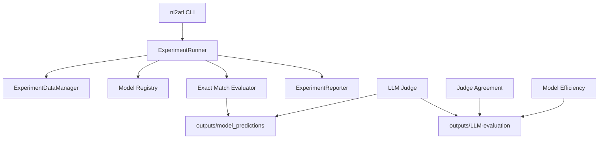
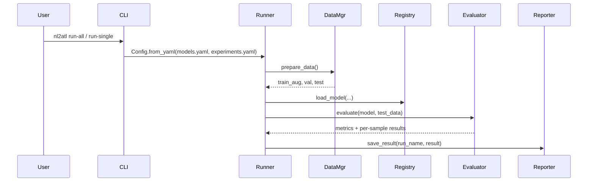
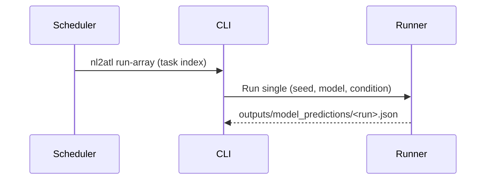

# Architecture

This document summarizes NL2ATL’s current module layout and data flow as implemented in the codebase.

## High‑level flow



## Package structure

```
src/
  cli/              CLI entry points (run-all, run-single, run-array, judge, etc.)
  experiment/       experiment orchestration and reporting
  models/           model loading, prompt formatting, generation
  evaluation/       exact-match, LLM judge, agreement, efficiency, difficulty
  infra/            I/O helpers and Azure utilities
  data_utils.py     dataset split + augmentation helpers
  api_server.py     FastAPI service
```

## Key responsibilities

- `src/cli/` — command parsing and task dispatch
- `src/experiment/` — data splits, training/inference runs, output persistence
- `src/models/` — model loading (HF/Azure), caching, few‑shot prompt formatting
- `src/evaluation/` — exact‑match evaluation, LLM‑as‑judge pipeline, agreement, efficiency, difficulty
- `src/infra/` — I/O helpers, Azure config/client, environment utilities
- `src/data_utils.py` — stratified split and augmentation utilities

## Execution workflows

### Experiment workflow (local or single node)



### SLURM array workflow (recommended for sweeps)



`run-array` maps each SLURM array index to exactly one $(seed, model, condition)$ task.

## Output artifacts

```
outputs/
  model_predictions/<run_name>.json
  LLM-evaluation/
    evaluated_datasets/<judge>/...
    summary__judge-<judge>.json
    agreement_report.json
    efficiency_report.json
```

## Where to extend

- Add models: update `configs/models.yaml` and provider logic in `src/models/registry.py`.
- Add CLI tasks: create `src/cli/run_*.py` and register in `src/cli/main.py`.
- Add evaluators: implement `BaseEvaluator` in `src/evaluation/base.py`.
