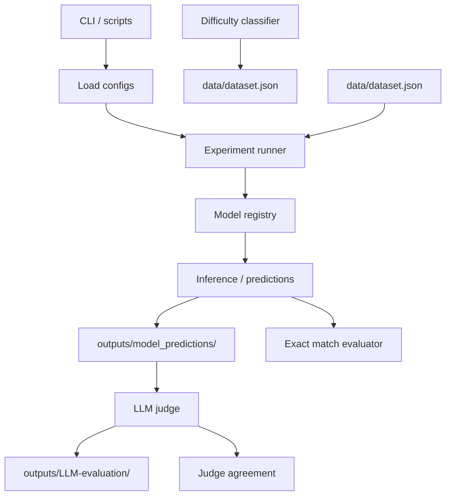

# Architecture

NL2ATL is a lightweight Python package with CLI entry points. It separates experiment orchestration, model loading, evaluation, and data utilities into focused modules under `src/`. Top-level scripts are thin wrappers around the core package to keep the project reproducible and easy to run in batch.

## Project Structure

```
nl2atl/
├── nl2atl.py                  # CLI entrypoint (aggregates subcommands)
├── configs/
│   ├── experiments.yaml       # Experiment configurations
│   └── models.yaml            # Model definitions
├── data/
│   └── dataset.json           # Dataset and difficulty labels
├── outputs/
│   ├── model_predictions/     # Inference outputs (one file per run)
│   └── LLM-evaluation/
│       └── evaluated_datasets/  # Judge decisions by judge model
├── docs/                      # Documentation
├── tests/                     # Unit tests
├── src/
│   ├── cli/                   # CLI argument parsing
│   │   ├── main.py
│   │   ├── run_all_experiments.py
│   │   ├── run_single_experiment.py
│   │   ├── run_llm_judge.py
│   │   ├── run_judge_agreement.py
│   │   └── classify_difficulty.py
│   ├── experiment/            # Experiment orchestration
│   │   ├── runner.py
│   │   ├── data_manager.py
│   │   └── reporter.py
│   ├── models/                # Model loading and prompting
│   │   ├── registry.py
│   │   ├── utils.py
│   │   └── few_shot.py
│   ├── evaluation/            # Evaluation logic
│   │   ├── base.py
│   │   ├── exact_match.py
│   │   ├── difficulty.py
│   │   ├── judge_agreement.py
│   │   └── llm_judge/
│   │       ├── client.py
│   │       ├── prompts.py
│   │       ├── parser.py
│   │       ├── cache.py
│   │       ├── metrics.py
│   │       └── pipeline.py
│   ├── infra/                 # Infrastructure utilities
│   │   ├── azure.py
│   │   ├── io.py
│   │   └── env.py
│   ├── config.py              # Config parsing and validation
│   ├── constants.py           # Shared constants
│   └── data_utils.py          # Dataset loading and preprocessing

```

## Core Modules

### Experiment Orchestration

| Module | Responsibility |
|--------|----------------|
| `experiment/runner.py` | End-to-end workflow: load config → load model → run predictions → persist outputs → optionally evaluate |
| `models/few_shot.py` | Selection and formatting of few-shot examples |

### Model Lifecycle

| Module | Responsibility |
|--------|----------------|
| `models/registry.py` | Model loading, device placement, GPU memory management |
| `models/utils.py` | Tokenization, batching, inference utilities |

### Evaluation

| Module | Responsibility |
|--------|----------------|
| `evaluation/llm_judge/` | LLM-as-a-judge pipeline and summary metrics |
| `evaluation/judge_agreement.py` | Inter-rater agreement metrics |
| `evaluation/exact_match.py` | Deterministic string-based evaluation |
| `evaluation/difficulty.py` | Rule-based difficulty scoring |

### Data & Configuration

| Module | Responsibility |
|--------|----------------|
| `data_utils.py` | Dataset loading, preprocessing, splitting |
| `config.py` | Schema-like parsing and validation for `configs/` |
| `constants.py` | Shared constants (paths, keys, defaults) |
| `infra/io.py` | File I/O and logging helpers |

### Environment & Infrastructure

| Module | Responsibility |
|--------|----------------|
| `infra/env.py` | Environment variable access and secrets wiring |
| `infra/azure.py` | Azure-specific helpers (auth, endpoints, logging) |

### CLI Layer

| Module | Responsibility |
|--------|----------------|
| `src/cli/main.py` | Subcommand aggregation and routing |
| `src/cli/run_*.py` | Argument parsing for each command |
| `nl2atl.py` | Repository-root entrypoint |

## High-Level Flow



## Execution Flow

| Step | Description |
|------|-------------|
| 1 | `configs/*.yaml` define models, prompts, and experiment settings |
| 2 | `experiment/runner` loads config, datasets, and model(s) |
| 3 | `models/registry` resolves and loads the model onto target device |
| 4 | Inference runs via `models/utils` (and `models/few_shot` when enabled) |
| 5 | Predictions written to `outputs/model_predictions/` |
| 6 | `evaluation/llm_judge` consumes predictions, writes to `outputs/LLM-evaluation/` |
| 7 | `evaluation/judge_agreement` produces agreement metrics across judges |
| 8 | `evaluation/exact_match` optionally computes deterministic scores |
| 9 | `evaluation/difficulty` updates difficulty labels in `data/` |

## Data Contracts

| Artifact | Location | Contract |
|----------|----------|----------|
| Dataset | `data/dataset.json` | Raw dataset with optional difficulty labels |
| Predictions | `outputs/model_predictions/` | One artifact per run with reproducibility metadata (config, model ID, seed) |
| Evaluations | `outputs/LLM-evaluation/evaluated_datasets/<judge>/` | Judge decisions and aggregated summaries, organized by judge model |

## Extensibility

**Add a new model**
1. Register in `src/models/registry.py`
2. Add entry to `configs/models.yaml`

**Add new evaluation logic**
1. Extend `src/evaluation/llm_judge/`, or
2. Add new evaluator module under `src/evaluation/`

**Add new CLI commands**
1. Create handler in `src/cli/`
2. Route from `src/cli/main.py`