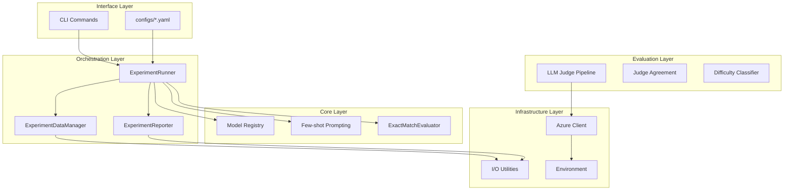
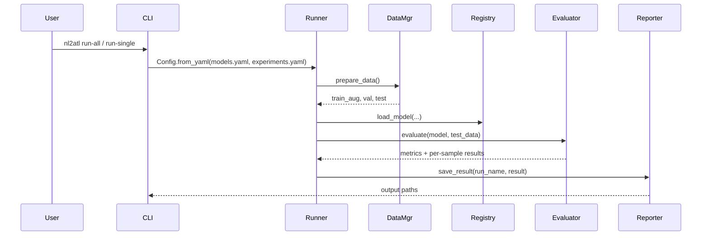
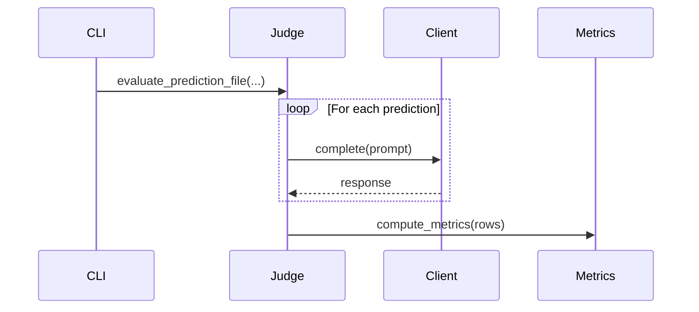
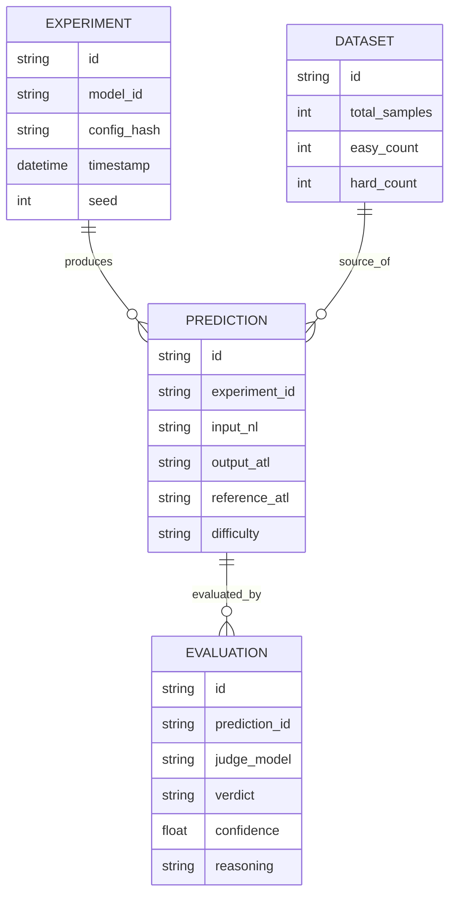
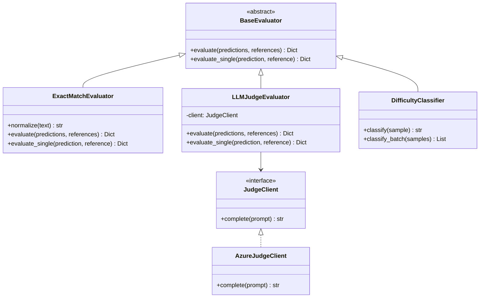
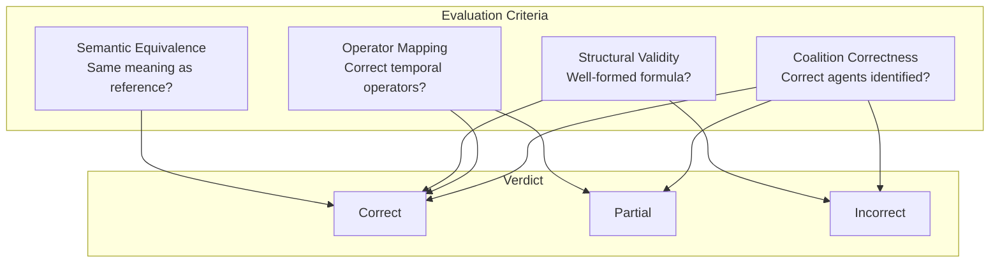
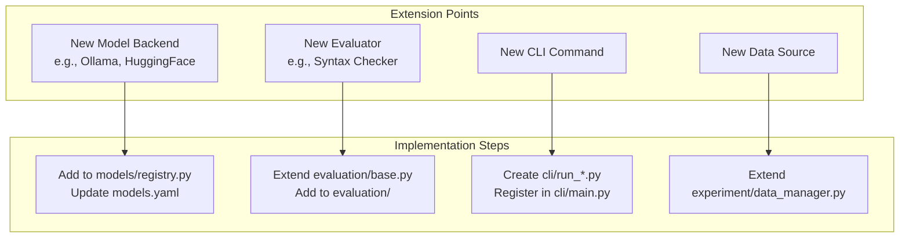
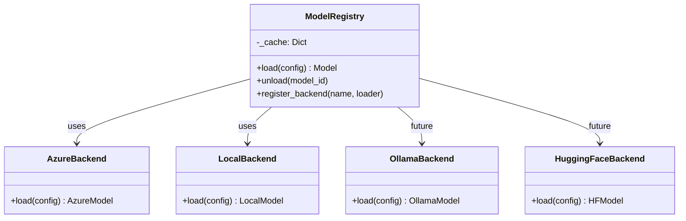

# Architecture

This document provides a concise overview of NL2ATL's architecture, module organization, and data flow as implemented in the current codebase.

## System Overview

NL2ATL uses a layered structure with a consolidated CLI that dispatches to task-specific subcommands.



## Execution Workflows

### Experiment Workflow



### LLM Judge Workflow



## Package Structure

```
src/
├── cli/                    # Command-Line Interface
│   ├── main.py             # Command dispatcher
│   ├── run_all_experiments.py
│   ├── run_single_experiment.py
│   ├── run_llm_judge.py
│   ├── run_judge_agreement.py
│   └── classify_difficulty.py
│
├── experiment/             # Experiment Orchestration
│   ├── runner.py           # Core experiment workflow
│   ├── data_manager.py     # Dataset handling
│   └── reporter.py         # Logging and output
│
├── models/                 # Model Management
│   ├── registry.py         # Model loading and caching
│   ├── utils.py            # Model utilities
│   └── few_shot.py         # Few-shot prompting
│
├── evaluation/             # Evaluation Framework
│   ├── base.py             # Abstract evaluator interface
│   ├── exact_match.py      # Exact-match evaluation
│   ├── difficulty.py       # Difficulty classification
│   ├── judge_agreement.py  # Inter-rater metrics
│   ├── model_efficiency.py # Cost/latency/accuracy trade-off report
│   └── llm_judge/          # LLM-as-a-Judge Pipeline
│       ├── client.py       # LLM client wrappers
│       ├── prompts.py      # Prompt templates
│       ├── parser.py       # Response parsing
│       ├── pipeline.py     # Orchestration
│       └── metrics.py      # Metric computation
│
├── infra/                  # Infrastructure
│   ├── azure.py            # Azure OpenAI client
│   ├── io.py               # File I/O utilities
│   └── env.py              # Environment management
│
├── config.py               # Configuration schema
└── constants.py            # Shared constants
```

## Data Flow

### Prediction File Structure

Experiments write JSON files in `outputs/model_predictions/` with:

- `metadata`: run details (model, condition, seed, timing)
- `predictions`: list of evaluated samples

### LLM Judge Outputs

The LLM judge writes evaluated datasets to `outputs/LLM-evaluation/evaluated_datasets/<judge>/` and a summary JSON plus an optional notebook.

### Model Efficiency Outputs

The efficiency report aggregates metrics from prediction files and (optionally) LLM judge summaries, producing:

- `outputs/LLM-evaluation/efficiency_report.json`
- `outputs/LLM-evaluation/efficiency_report.ipynb`

## Extensibility Points

- Add new models by extending `configs/models.yaml` and, if needed, provider logic in `src/models/registry.py`.
- Add new evaluators by implementing `BaseEvaluator` in `src/evaluation/`.
- Add new CLI tasks by adding a `src/cli/*.py` entry and registering it in `src/cli/main.py`.
    end
    
    subgraph "Output"
        ATL["ATL* Formula<br/>⟨⟨A,B⟩⟩ F win"]
    end
    
    NL --> P1
    P1 --> P2
    P2 --> P3
    P3 --> P4
    P4 --> P5
    P5 --> ATL
```

### Artifact Relationships



---

## Evaluation Pipeline

### Evaluation Methods Hierarchy



### Evaluation for ATL* Translation

The evaluation considers ATL*-specific criteria:



---

## Extensibility Points

### Adding New Components



### Model Backend Extension



---

## Output Structure

### Directory Organization

```
outputs/
├── model_predictions/
│   ├── {model}_{timestamp}_{seed}.json
│   └── ...
└── LLM-evaluation/
    └── evaluated_datasets/
        └── {judge_model}/
            ├── {experiment_id}_verdicts.json
            ├── {experiment_id}_metrics.json
            └── agreement_report.json
```

### Prediction Artifact Schema

```json
{
  "metadata": {
    "experiment_id": "qwen32b_fewshot_20240115",
    "model_id": "qwen-32b",
    "timestamp": "2024-01-15T10:30:00Z",
    "seed": 42,
    "few_shot_count": 3
  },
  "predictions": [
    {
      "id": "sample_001",
      "input_nl": "The user can guarantee that...",
      "output_atl": "⟨⟨User⟩⟩ X ¬timeout",
      "reference_atl": "⟨⟨User⟩⟩ X ¬timeout",
      "difficulty": "easy"
    }
  ]
}
```
