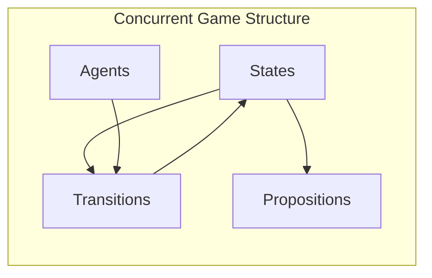

# ATL* Primer

This document provides a brief introduction to Alternating-Time Temporal Logic (ATL*) for readers unfamiliar with strategic logics. NL2ATL uses ATL-style formulas with ASCII coalition syntax (e.g., `<<A,B>>`).

## Table of Contents

- [Motivation](#motivation)
- [From LTL to ATL*](#from-ltl-to-atl)
- [Syntax](#syntax)
- [Semantics](#semantics)
- [Examples](#examples)
- [Relation to NL2ATL](#relation-to-nl2atl)

---

## Motivation

In multi-agent systems, we often need to reason about what agents or groups of agents *can achieve* through strategic cooperation, even when facing adversarial opponents. Standard temporal logics like LTL cannot express such properties because they lack the notion of *agency* and *strategy*.

**Example Question**: "Can the security team guarantee that the system will eventually reach a safe state, regardless of what the attacker does?"

This question involves:
- A **coalition** (security team)
- A **strategic ability** (can guarantee)
- A **temporal objective** (eventually safe)
- **Adversarial quantification** (regardless of attacker)

ATL* provides the formal machinery to express exactly this.

---

## From LTL to ATL*

### LTL (Linear Temporal Logic)

LTL reasons about properties of execution paths:

| Operator | Meaning | Example |
|----------|---------|---------|
| `X φ` | **Next**: φ holds in the next state | `X safe` |
| `F φ` | **Finally**: φ holds eventually | `F goal` |
| `G φ` | **Globally**: φ holds always | `G ¬error` |
| `φ U ψ` | **Until**: φ holds until ψ | `trying U success` |

### ATL* Extension

ATL* adds **strategic modalities** that quantify over agent strategies:

| Modality | Meaning |
|----------|---------|
| `⟨⟨A⟩⟩ φ` | Coalition A **has a strategy** to ensure φ |
| `[[A]] φ` | **All strategies** of coalition A lead to φ |

The key insight: `⟨⟨A⟩⟩ φ` means "the agents in A can cooperate to guarantee φ, no matter what the other agents do."

---

## Syntax

### Agents and Coalitions

- **Agents**: Individual entities (e.g., `User`, `Robot`, `Attacker`)
- **Coalitions**: Sets of agents (e.g., `{User, Robot}`, denoted `⟨⟨User, Robot⟩⟩`)
- **Grand coalition**: All agents (`⟨⟨Σ⟩⟩`)
- **Empty coalition**: No agents (`⟨⟨∅⟩⟩`)

### Formula Structure

```
φ ::= p                    (atomic proposition)
    | ¬φ | φ ∧ ψ | φ ∨ ψ   (boolean connectives)
    | ⟨⟨A⟩⟩ ψ              (strategic modality)
    | X φ | F φ | G φ       (temporal operators)
    | φ U ψ                 (until)
```

### Operator Precedence

```
¬ > ∧ > ∨ > → > X, F, G, U > ⟨⟨A⟩⟩
```

---

## Semantics

ATL* formulas are interpreted over **Concurrent Game Structures (CGS)**:



### Informal Semantics

| Formula | Meaning |
|---------|---------|
| `⟨⟨A⟩⟩ X p` | A can ensure p holds next |
| `⟨⟨A⟩⟩ F p` | A can eventually make p true |
| `⟨⟨A⟩⟩ G p` | A can maintain p forever |
| `⟨⟨A⟩⟩ p U q` | A can maintain p until achieving q |
| `⟨⟨∅⟩⟩ F p` | p is inevitable (no strategy needed) |
| `⟨⟨Σ⟩⟩ F p` | p is achievable (all cooperate) |

---

## Examples

### Example 1: Simple Ability

**Natural Language**: "The user can guarantee that the system will not time out in the next step."

**ATL* Formula**: `⟨⟨User⟩⟩ X ¬timeout`

### Example 2: Coalition Strategy

**Natural Language**: "Rovers A and B can eventually reach the flag together, despite the actions of the opponent."

**ATL* Formula**: `⟨⟨A, B⟩⟩ F win`

### Example 3: Conditional Strategy

**Natural Language**: "The controller can ensure that whenever a request arrives, it is eventually granted."

**ATL* Formula**: `⟨⟨Controller⟩⟩ G(request → F grant)`

### Example 4: Nested Strategies

**Natural Language**: "The defender can ensure that the attacker cannot eventually compromise the system."

**ATL* Formula**: `⟨⟨Defender⟩⟩ G ¬(⟨⟨Attacker⟩⟩ F compromised)`

### Example 5: Complex Narrative (from dataset)

**Natural Language** (from Homer's Iliad):
> "If I stay here and fight, I shall not return alive but my name will live for ever; whereas if I go home my name will die, but it will be long ere death shall take me."

**ATL* Formula**:
```
⟨⟨Achilles⟩⟩ G((stay_here ∧ fight) → (die ∧ name_lives))
∨ ⟨⟨Achilles⟩⟩ (go_home → (name_dies ∧ live_longer))
```

---

## Common Patterns

### Safety Properties

"A can ensure bad never happens":
```
⟨⟨A⟩⟩ G ¬bad
```

### Liveness Properties

"A can eventually achieve good":
```
⟨⟨A⟩⟩ F good
```

### Response Properties

"A can ensure every request gets a response":
```
⟨⟨A⟩⟩ G(request → F response)
```

### Invariant Maintenance

"A can maintain safe until reaching goal":
```
⟨⟨A⟩⟩ (safe U goal)
```

---

## ATL vs ATL*

| Feature | ATL | ATL* |
|---------|-----|------|
| Temporal nesting | Restricted | Full |
| Path quantifiers | Implicit | Explicit |
| Expressiveness | Less | More |
| Model checking | PTIME | 2EXPTIME |

**ATL** restricts temporal operators to appear immediately after strategic modalities:
- ✓ `⟨⟨A⟩⟩ F p`
- ✗ `⟨⟨A⟩⟩ F G p` (not valid ATL, but valid ATL*)

**ATL*** allows arbitrary nesting of temporal operators within strategic contexts.

---

## Relation to NL2ATL

The NL2ATL framework addresses the challenge of translating natural language descriptions into correct ATL formulas. Key challenges include:

1. **Coalition Identification**: Determining which agents form a coalition
2. **Strategic vs. Temporal**: Distinguishing strategic ability from temporal inevitability
3. **Operator Mapping**: Mapping linguistic expressions to temporal operators
4. **Scope Resolution**: Correctly nesting modalities and operators

### Translation Challenges

| NL Expression | Challenge | ATL |
|---------------|-----------|------|
| "can ensure" | Strategic modality | `<<A>>` |
| "will always" | Temporal operator | `G` |
| "despite the opponent" | Adversarial quantification | Implicit in `<<A>>` |
| "in all states" | Global operator | `G` |
| "at some point" | Eventually operator | `F` |

### NL2ATL Output Syntax

NL2ATL outputs ASCII coalition notation (e.g., `<<User,Machine>>`) and logical symbols `!`, `&&`, `||`, `->`.

---

## Further Reading

- Alur, R., Henzinger, T.A., & Kupferman, O. (2002). *Alternating-time temporal logic*. JACM.
- Belardinelli, F., et al. (2018). *ATL with finite traces*. 
- [VITAMIN Model Checker](https://github.com/...)