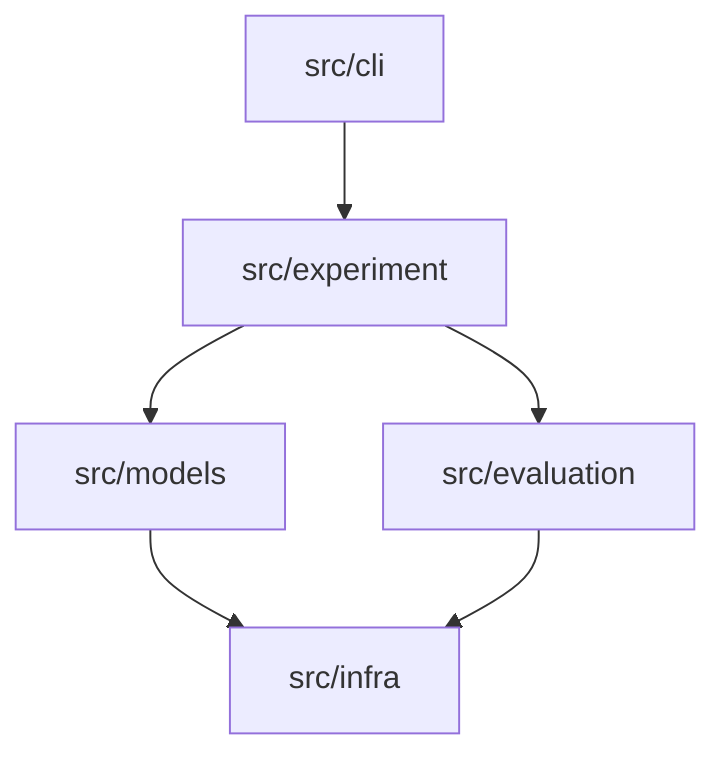

# Development Guide

This guide covers contributing to NL2ATL and extending its functionality.

## Table of Contents

- [Development Setup](#development-setup)
- [Code Organization](#code-organization)
- [Testing](#testing)
- [Adding New Features](#adding-new-features)

---

## Development Setup

### Prerequisites

- Python 3.10+
- Git
- (Optional) CUDA-capable GPU for local models

### Setup

```bash
git clone https://github.com/[your-org]/nl2atl.git
cd nl2atl

python -m venv .venv
source .venv/bin/activate

pip install -r requirements.txt
pip install -e .
```

---

## Code Organization



Guidelines:

- `cli/`: argument parsing and dispatch only
- `experiment/`: orchestration and result management
- `models/`: model loading, inference, and utilities
- `evaluation/`: scoring, LLM judge, and agreement metrics
- `infra/`: I/O and cloud clients

---

## Testing

Run all tests:

```bash
pytest -q
```

Tests live directly under `tests/` (for example: `tests/test_config.py`, `tests/test_data_utils.py`).

---

## Adding New Features

### Adding a New Model

1. Add a model entry to `configs/models.yaml`.
2. If needed, extend provider logic in `src/models/registry.py`.

### Adding a New Evaluator

1. Implement a new class extending `BaseEvaluator` in `src/evaluation/`.
2. Export it from `src/evaluation/__init__.py` if it should be public.
3. Add tests in `tests/`.

### Adding a CLI Command

1. Create a handler in `src/cli/` with a `main()` function.
2. Register it in `src/cli/main.py` by adding to `_COMMANDS`.
