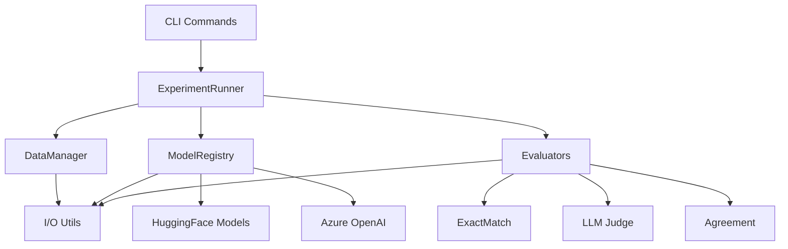

# Development Guide

This guide covers contributing to NL2ATL, extending its functionality, and best practices for development. Whether you're fixing bugs, adding features, or integrating NL2ATL into your own project, this guide will help you get started.

## Table of Contents

1. [Development Setup](#development-setup)
2. [Project Structure](#project-structure)
3. [Code Organization](#code-organization)
4. [Adding New Features](#adding-new-features)
5. [Testing](#testing)
6. [Code Style](#code-style)
7. [Contributing](#contributing)
8. [Extension Points](#extension-points)

---

## Development Setup

### Prerequisites

- Python 3.10+
- Git
- Virtual environment tool
- (Optional) CUDA-capable GPU for local models

### Installation

```bash
# Clone repository
git clone https://github.com/vladanaSTM/nl2atl.git
cd nl2atl

# Create virtual environment
python -m venv .venv
source .venv/bin/activate  # On Windows: .venv\Scripts\Activate.ps1

# Install dependencies
pip install -r requirements.txt

# Install in editable mode (enables 'nl2atl' command)
pip install -e .

# Verify installation
nl2atl --help
pytest -q
```

### Development Dependencies

For development and testing:

```bash
# Install additional dev tools
pip install pytest pytest-cov black flake8 mypy pre-commit
```

### Pre-commit Hooks (Optional)

```bash
# Install pre-commit hooks for automatic formatting
pre-commit install

# Run manually on all files
pre-commit run --all-files
```

---

## Project Structure

### Directory Layout

```
nl2atl/
├── configs/                 # Configuration files
│   ├── models.yaml         # Model registry
│   └── experiments.yaml    # Experiment conditions
├── data/                   # Dataset
│   └── dataset.json
├── docs/                   # Documentation
├── integrations/           # External tool integrations
│   └── genvitamin/        # genVITAMIN model checker
├── outputs/               # Generated results (created at runtime)
│   ├── model_predictions/
│   └── LLM-evaluation/
├── src/                   # Source code
│   ├── __init__.py
│   ├── api_server.py      # FastAPI service
│   ├── config.py          # Configuration classes
│   ├── constants.py       # Constants and enums
│   ├── data_utils.py      # Dataset utilities
│   ├── cli/               # Command-line interface
│   │   ├── __init__.py
│   │   ├── main.py        # CLI dispatcher
│   │   ├── run_single_experiment.py
│   │   ├── run_all_experiments.py
│   │   ├── run_experiment_array.py
│   │   ├── llm_judge.py
│   │   ├── judge_agreement.py
│   │   ├── model_efficiency.py
│   │   └── classify_difficulty.py
│   ├── experiment/        # Experiment orchestration
│   │   ├── __init__.py
│   │   ├── runner.py      # ExperimentRunner
│   │   ├── data_manager.py  # Data splitting
│   │   └── reporter.py    # Result persistence
│   ├── models/            # Model loading and inference
│   │   ├── __init__.py
│   │   ├── registry.py    # Model registry
│   │   ├── model_utils.py # Utilities
│   │   ├── model_hf.py    # HuggingFace loader
│   │   ├── model_azure.py # Azure loader
│   │   └── prompt_formatter.py
│   ├── evaluation/        # Evaluation pipelines
│   │   ├── __init__.py
│   │   ├── base.py        # BaseEvaluator
│   │   ├── exact_match.py
│   │   ├── difficulty.py
│   │   ├── judge_agreement.py
│   │   ├── model_efficiency.py
│   │   └── llm_judge/
│   │       ├── __init__.py
│   │       ├── judge.py
│   │       ├── evaluator.py
│   │       └── prompts.py
│   └── infra/             # Infrastructure
│       ├── __init__.py
│       ├── io.py          # File I/O
│       ├── env.py         # Environment loading
│       └── azure_client.py
├── tests/                 # Unit tests
│   ├── conftest.py
│   ├── test_config.py
│   ├── test_data_utils.py
│   ├── test_difficulty.py
│   ├── test_exact_match.py
│   ├── test_experiment_data_manager.py
│   ├── test_few_shot.py
│   ├── test_infra_io.py
│   ├── test_judge_agreement.py
│   ├── test_llm_judge.py
│   ├── test_model_efficiency.py
│   └── test_model_utils.py
├── scripts/               # Utility scripts
│   └── slurm/
│       └── submit_array.sh
├── .env.example           # Environment template
├── .gitignore
├── LICENSE
├── README.md
├── nl2atl.py              # CLI entrypoint
├── pyproject.toml         # Package configuration
└── requirements.txt       # Dependencies
```

### Module Responsibilities

| Module | Purpose | Key Files |
|--------|---------|-----------|
| `cli/` | Command-line interface, argument parsing | `main.py`, `run_*.py` |
| `experiment/` | Experiment orchestration, data management | `runner.py`, `data_manager.py` |
| `models/` | Model loading, inference, prompt formatting | `registry.py`, `model_*.py` |
| `evaluation/` | Evaluation metrics, LLM judge, analysis | `exact_match.py`, `llm_judge/` |
| `infra/` | I/O utilities, Azure client, environment | `io.py`, `azure_client.py` |

---

## Code Organization

### Design Principles

1. **Separation of Concerns**: Each module has a single, clear responsibility
2. **Dependency Injection**: Pass dependencies explicitly (configs, models, etc.)
3. **Type Hints**: Use type hints throughout for clarity and IDE support
4. **Error Handling**: Explicit exception handling with informative messages
5. **Testability**: Write testable code with clear interfaces

### Architecture Overview



### Key Classes

#### Config

```python
from pathlib import Path
from src.config import Config

config = Config.from_yaml(
    models_yaml=Path("configs/models.yaml"),
    experiments_yaml=Path("configs/experiments.yaml")
)
```

**Purpose**: Load and validate configuration  
**Location**: `src/config.py`

#### ExperimentRunner

```python
from src.experiment import ExperimentRunner

runner = ExperimentRunner(config)
result = runner.run_experiment(
    model_key="qwen-3b",
    condition="baseline_few_shot",
    seed=42
)
```

**Purpose**: Orchestrate experiment execution  
**Location**: `src/experiment/runner.py`

#### ModelRegistry

```python
from src.models import load_model

model, tokenizer = load_model(
    model_key="qwen-3b",
    models_config=config.models
)
```

**Purpose**: Load models from configuration  
**Location**: `src/models/registry.py`

---

## Adding New Features

### Adding a New Model

To add support for a new model:

**1. Add model to `configs/models.yaml`:**

```yaml
models:
  my-model:
    name: "myorg/my-model"
    short_name: "my-model"
    provider: "huggingface"
    max_seq_length: 512
    load_in_4bit: false
    lora_r: 64
    lora_alpha: 128
    target_modules: [q_proj, k_proj, v_proj, o_proj]
```

**2. (Optional) Extend provider logic:**

If your model requires special handling, extend `src/models/registry.py`:

```python
def load_model(model_key: str, models_config: dict, **kwargs):
    model_config = models_config[model_key]
    
    if model_config.provider == "huggingface":
        # Existing HuggingFace logic
        pass
    elif model_config.provider == "mycloud":
        # Add new provider
        return load_mycloud_model(model_config, **kwargs)
```

**3. Test the model:**

```bash
nl2atl run-single --model my-model --few_shot
```

---

### Adding a New Evaluator

To add a custom evaluation metric:

**1. Create evaluator class:**

```python
# src/evaluation/my_evaluator.py
from typing import Dict, Any
from src.evaluation.base import BaseEvaluator

class MyEvaluator(BaseEvaluator):
    """Custom evaluator for specific metric."""
    
    def evaluate(self, prediction: str, reference: str) -> Dict[str, Any]:
        """Evaluate single prediction."""
        # Your evaluation logic here
        score = self._compute_score(prediction, reference)
        
        return {
            "my_metric": score,
            "correct": score > threshold
        }
    
    def evaluate_dataset(self, predictions: list) -> Dict[str, float]:
        """Evaluate entire dataset."""
        results = [
            self.evaluate(pred["generated"], pred["expected"])
            for pred in predictions
        ]
        
        return {
            "my_metric_mean": sum(r["my_metric"] for r in results) / len(results),
            "accuracy": sum(r["correct"] for r in results) / len(results)
        }
```

**2. Export from module:**

```python
# src/evaluation/__init__.py
from .my_evaluator import MyEvaluator

__all__ = ["MyEvaluator", ...]
```

**3. Add tests:**

```python
# tests/test_my_evaluator.py
from src.evaluation import MyEvaluator

def test_my_evaluator():
    evaluator = MyEvaluator()
    result = evaluator.evaluate(
        prediction="<<A>>F p",
        reference="<<A>>F p"
    )
    assert result["correct"] == True
```

**4. Use in experiments:**

```python
from src.evaluation import MyEvaluator

evaluator = MyEvaluator()
metrics = evaluator.evaluate_dataset(predictions)
print(metrics)
```

---

### Adding a New CLI Command

To add a new command to the CLI:

**1. Create command module:**

```python
# src/cli/my_command.py
import click
from pathlib import Path

@click.command()
@click.option("--input", type=Path, required=True, help="Input file")
@click.option("--output", type=Path, help="Output file")
def main(input: Path, output: Path):
    """My custom command description."""
    # Your command logic here
    print(f"Processing {input}...")
    
    # Do work
    result = process(input)
    
    # Save output
    if output:
        save(result, output)
        print(f"Saved to {output}")

def process(input_path):
    """Core processing logic."""
    # Implementation
    pass

if __name__ == "__main__":
    main()
```

**2. Register in main CLI:**

```python
# src/cli/main.py
from src.cli.my_command import main as my_command_main

# Add to command group
cli.add_command(my_command_main, name="my-command")
```

**3. Test the command:**

```bash
nl2atl my-command --help
nl2atl my-command --input data/dataset.json
```

---

### Adding Configuration Options

To add new configuration fields:

**1. Update YAML schema:**

```yaml
# configs/experiments.yaml
my_feature:
  enabled: bool
  parameter: int
```

**2. Update Config class:**

```python
# src/config.py
@dataclass
class Config:
    # Existing fields...
    
    # Add new field
    my_feature_enabled: bool = False
    my_feature_parameter: int = 10
    
    @classmethod
    def from_yaml(cls, models_yaml, experiments_yaml):
        # Load YAMLs
        exp_data = load_yaml(experiments_yaml)
        
        # Extract new field
        my_feature = exp_data.get("my_feature", {})
        
        return cls(
            # Existing parameters...
            my_feature_enabled=my_feature.get("enabled", False),
            my_feature_parameter=my_feature.get("parameter", 10)
        )
```

**3. Use in code:**

```python
config = Config.from_yaml(...)
if config.my_feature_enabled:
    # Use feature
    do_something(config.my_feature_parameter)
```

---

## Testing

### Running Tests

```bash
# Run all tests
pytest

# Run with verbose output
pytest -v

# Run specific test file
pytest tests/test_config.py

# Run specific test
pytest tests/test_config.py::test_config_validation

# Run with coverage
pytest --cov=src tests/
```

### Writing Tests

Use pytest fixtures and parametrize for comprehensive testing:

```python
# tests/test_my_feature.py
import pytest
from src.my_module import my_function

@pytest.fixture
def sample_data():
    """Fixture providing sample data."""
    return {
        "input": "test input",
        "expected": "test output"
    }

def test_my_function(sample_data):
    """Test basic functionality."""
    result = my_function(sample_data["input"])
    assert result == sample_data["expected"]

@pytest.mark.parametrize("input,expected", [
    ("<<A>>F p", True),
    ("<<A>>G q", True),
    ("invalid", False),
])
def test_my_function_cases(input, expected):
    """Test multiple cases."""
    result = my_function(input)
    assert result == expected

def test_my_function_error():
    """Test error handling."""
    with pytest.raises(ValueError):
        my_function(None)
```

### Test Organization

- One test file per module: `src/foo.py` → `tests/test_foo.py`
- Group related tests in classes
- Use descriptive test names: `test_feature_when_condition_then_result`
- Use fixtures for shared setup

---

## Code Style

### Python Style

NL2ATL follows [PEP 8](https://pep8.org/) with these conventions:

**Formatting:**
- 4 spaces for indentation
- 100 character line length
- Use double quotes for strings
- Use trailing commas in multi-line collections

**Naming:**
- `snake_case` for functions and variables
- `PascalCase` for classes
- `UPPER_CASE` for constants
- Prefix private members with `_`

**Example:**

```python
from typing import Dict, List, Optional
from pathlib import Path

class MyClass:
    """Class docstring."""
    
    DEFAULT_VALUE = 10
    
    def __init__(self, config: Dict[str, Any]):
        self.config = config
        self._cache = {}
    
    def public_method(self, param: str) -> Optional[int]:
        """Method docstring.
        
        Args:
            param: Parameter description
            
        Returns:
            Result description
        """
        result = self._private_method(param)
        return result
    
    def _private_method(self, param: str) -> int:
        """Private helper method."""
        # Implementation
        pass
```

### Type Hints

Use type hints consistently:

```python
from typing import Dict, List, Optional, Tuple, Union, Any
from pathlib import Path

def process_data(
    input_path: Path,
    config: Dict[str, Any],
    verbose: bool = False
) -> Tuple[List[str], Dict[str, float]]:
    """Process data from file."""
    # Implementation
    return predictions, metrics
```

### Documentation

Write clear docstrings:

```python
def complex_function(param1: str, param2: int, flag: bool = False) -> Dict[str, Any]:
    """Short one-line summary.
    
    Longer description explaining what the function does,
    any important details, and usage examples.
    
    Args:
        param1: Description of param1
        param2: Description of param2
        flag: Optional flag (default: False)
    
    Returns:
        Dictionary containing:
            - 'result': The computed result
            - 'metadata': Additional information
    
    Raises:
        ValueError: If param1 is empty
        FileNotFoundError: If file doesn't exist
    
    Example:
        >>> result = complex_function("test", 42, flag=True)
        >>> print(result['result'])
        'output'
    """
    pass
```

### Formatting Tools

```bash
# Format code with black
black src/ tests/

# Check style with flake8
flake8 src/ tests/

# Type checking with mypy
mypy src/
```

---

## Contributing

### Contribution Workflow

1. **Fork the repository**
2. **Create a feature branch**:
   ```bash
   git checkout -b feature/my-feature
   ```
3. **Make changes and commit**:
   ```bash
   git add .
   git commit -m "Add my feature"
   ```
4. **Write tests**:
   ```bash
   pytest tests/test_my_feature.py
   ```
5. **Ensure all tests pass**:
   ```bash
   pytest
   ```
6. **Push to your fork**:
   ```bash
   git push origin feature/my-feature
   ```
7. **Create pull request** on GitHub

### Pull Request Guidelines

**Before submitting:**
- [ ] All tests pass
- [ ] Code follows style guide
- [ ] Documentation updated
- [ ] Commit messages are descriptive

**PR Description should include:**
- What changed and why
- How to test the changes
- Any breaking changes
- Related issues (if any)

### Code Review Process

1. Maintainer reviews PR
2. Address feedback if needed
3. Once approved, PR is merged
4. Changes appear in next release

---

## Extension Points

### Custom Data Augmentation

Extend `src/data_utils.py`:

```python
def my_augmentation(sample: Dict[str, Any]) -> Dict[str, Any]:
    """Custom augmentation strategy."""
    # Your augmentation logic
    augmented_input = transform(sample["input"])
    
    return {
        "input": augmented_input,
        "output": sample["output"]
    }
```

### Custom Prompt Templates

Extend `src/models/prompt_formatter.py`:

```python
def my_prompt_template(
    example: Dict[str, str],
    few_shot_examples: Optional[List[Dict]] = None
) -> str:
    """Custom prompt template."""
    prompt = "Task: Generate ATL formula\n\n"
    
    if few_shot_examples:
        for ex in few_shot_examples:
            prompt += f"Input: {ex['input']}\n"
            prompt += f"Output: {ex['output']}\n\n"
    
    prompt += f"Input: {example['input']}\n"
    prompt += "Output:"
    
    return prompt
```

### Custom Result Reporting

Extend `src/experiment/reporter.py`:

```python
class MyReporter:
    """Custom result reporter."""
    
    def save_result(self, result: Dict, output_path: Path):
        """Save result in custom format."""
        # Your reporting logic
        pass
```

---

## Debugging

### Common Issues

**Import errors:**
```bash
# Ensure PYTHONPATH includes repo root
export PYTHONPATH=.
```

**Config not found:**
```bash
# Run from repo root or set absolute paths
cd /path/to/nl2atl
nl2atl run-single --model qwen-3b
```

**Model loading fails:**
```python
# Enable verbose logging
import logging
logging.basicConfig(level=logging.DEBUG)
```

### Debugging Tools

**Python debugger:**
```python
import pdb; pdb.set_trace()  # Set breakpoint
```

**IPython for interactive debugging:**
```bash
pip install ipython
ipython
```

**Logging:**
```python
import logging
logger = logging.getLogger(__name__)
logger.debug("Debug message")
logger.info("Info message")
logger.warning("Warning message")
```

---

## Best Practices

1. **Write tests first** (TDD approach)
2. **Keep functions small** (single responsibility)
3. **Use type hints** consistently
4. **Document public APIs** with docstrings
5. **Handle errors explicitly** with informative messages
6. **Follow existing patterns** in the codebase
7. **Use meaningful variable names**
8. **Avoid global state**
9. **Make dependencies explicit**
10. **Keep commits focused** and well-described

---

## Resources

- **Python Style Guide**: [PEP 8](https://pep8.org/)
- **Type Hints**: [mypy documentation](https://mypy.readthedocs.io/)
- **pytest**: [pytest documentation](https://docs.pytest.org/)
- **Click**: [Click documentation](https://click.palletsprojects.com/)
- **FastAPI**: [FastAPI documentation](https://fastapi.tiangolo.com/)

---

## Next Steps

- **Usage Guide**: [usage.md](usage.md) — CLI command reference
- **Configuration**: [configuration.md](configuration.md) — Config file format
- **Architecture**: [architecture.md](architecture.md) — System design
- **API Reference**: [api.md](api.md) — Public APIs

---

**Questions?** Check [full documentation](index.md) or [open an issue](https://github.com/vladanaSTM/nl2atl/issues).

**Want to contribute?** We welcome contributions! Start with an issue or discussion to coordinate.
