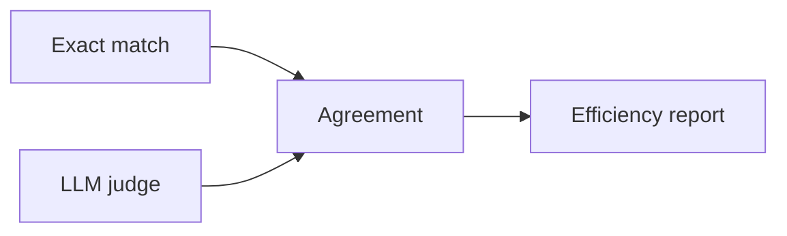

# Evaluation guide

This guide explains the evaluation pipeline: exact‑match scoring, LLM‑as‑judge evaluation, agreement metrics, and the efficiency report.

## Overview



## Exact match

Exact‑match compares generated formulas to references after normalization:

- Strip whitespace
- Normalize operators `∧`, `∨`, `¬`, `→` to ASCII
- Lowercase the formula

This is the default baseline metric used across the project.

## LLM‑as‑judge

The LLM judge checks semantic correctness beyond exact string match.

Run:

```bash
nl2atl llm-judge --datasets all
```

Use `--overwrite` or `--force` to re‑evaluate existing outputs.

### Judge prompt

The prompt is defined in [src/evaluation/llm_judge/prompts.py](../src/evaluation/llm_judge/prompts.py) and expects JSON like:

```json
{ "correct": "yes" | "no", "reasoning": "..." }
```

### Output format

Each evaluated file contains run metadata plus `detailed_results`:

```json
{
  "run_name": "qwen-3b_baseline_zero_shot",
  "judge_model": "gpt-5.2",
  "metrics": {
    "n_examples": 90,
    "exact_match": 0.82
  },
  "detailed_results": [
    {
      "input": "...",
      "gold": "<<User>>F p",
      "prediction": "<<User>>F p",
      "correct": "yes",
      "reasoning": "Exact match \(normalized\)",
      "decision_method": "exact"
    }
  ]
}
```

## Judge agreement

Compute agreement across judge outputs:

```bash
nl2atl judge-agreement --eval_dir outputs/LLM-evaluation/evaluated_datasets
```

The report includes:

- Pairwise Cohen’s $\kappa$
- Fleiss’ $\kappa$ when all judges rate the same items
- Krippendorff’s $\alpha$
- Optional disagreement samples

## Model efficiency report

This report aggregates accuracy, latency, and cost across models and derives normalized composite
scores. This helps quantify trade‑offs between quality and resource usage, enabling comparisons of
“best overall,” “cheapest,” and “fastest” models.

Run:

```bash
nl2atl model-efficiency --predictions_dir outputs/model_predictions
```

Outputs:

- `outputs/LLM-evaluation/efficiency_report.json`
- `outputs/LLM-evaluation/efficiency_report.ipynb`

### Metrics and rankings

The report includes:

- Accuracy (LLM‑judge accuracy when available, else exact‑match).
- Average cost and total cost (USD).
- Latency statistics and throughput.
- Composite efficiency score: normalized weighted sum of accuracy, cost, and latency.
- Rankings for cheapest, fastest, most accurate, and best composite score.

### USD cost calculation and pricing sources

Costs are derived from token usage and the per‑1k pricing in `configs/models.yaml`.

For Azure models:

$$
  ext{cost} = \frac{\text{tokens\_input}}{1000} \cdot \text{price\_input\_per\_1k} +
\frac{\text{tokens\_output}}{1000} \cdot \text{price\_output\_per\_1k}
$$

Token usage comes from the Azure API (or is estimated via tiktoken when usage is unavailable). Prices
should match the official Azure OpenAI and Azure AI Foundry Models pricing page.

For local GPU runs with `gpu_hour_usd`:

$$
  ext{tokens\_per\_hour} = \frac{\text{tokens\_total}}{\text{hours\_used}},
\quad
  ext{cost\_per\_1k\_tokens} = \frac{\text{gpu\_hour\_usd}}{\text{tokens\_per\_hour}} \cdot 1000
$$

For GPU/local models, you can either provide per‑token prices (`price_input_per_1k`,
`price_output_per_1k`) or a GPU hourly rate (`gpu_hour_usd`) in `configs/models.yaml`. If none of
these fields are set, cost‑based rankings are skipped for those models.

If you don’t know your GPU cost, you can estimate it:

1) **GPU amortization per hour**:
  $\text{gpu\_amort\_hour} = \frac{\text{gpu\_price\_usd}}{\text{lifespan\_years} \times 365 \times 24 \times \text{utilization}}$
  (use public MSRP or a public cloud on‑demand hourly price for an A100 as a proxy).
2) **Power cost per hour**:
  $\text{power\_hour} = \frac{\text{avg\_watts}}{1000} \times \text{electricity\_usd\_per\_kwh}$
  (average watts from `nvidia-smi` and electricity rate from public utility data).
3) **Overhead**: add 10–30% for shared infrastructure if you want a conservative estimate.

Then set:

$$
	ext{gpu\_hour\_usd} = \text{gpu\_amort\_hour} + \text{power\_hour} + \text{overhead\_hour}
$$

If neither per‑token prices nor `gpu_hour_usd` is set, cost rankings are omitted for that model.

## Human annotations

You can add a human‑annotated file as an additional judge during agreement analysis.
The human file may be either a list of items or a metadata dictionary with an `annotations` list.

Minimal item schema:

```json
{
  "input": "...",
  "gold": "<<A>>F goal",
  "prediction": "<<A>>F goal",
  "correct": "yes"
}
```

Run with humans:

```bash
nl2atl judge-agreement \
  --eval_dir outputs/LLM-evaluation/evaluated_datasets \
  --human_annotations path/to/human_annotations.json
```

## Extending evaluation

Implement custom evaluators by extending `BaseEvaluator` in [src/evaluation/base.py](../src/evaluation/base.py) and wiring them into your workflow.

