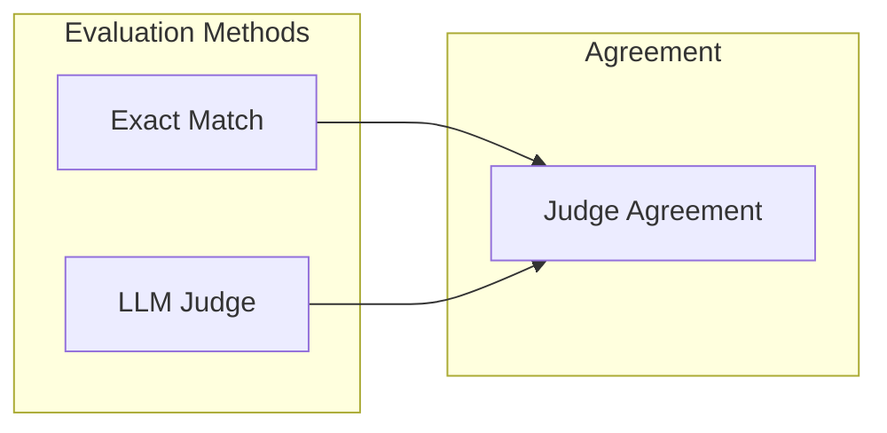

# Evaluation Guide

NL2ATL provides exact-match evaluation, LLM-as-a-judge evaluation, inter-rater agreement metrics, and model efficiency reporting.

## Table of Contents

- [Overview](#overview)
- [LLM-as-a-Judge](#llm-as-a-judge)
- [Exact Match](#exact-match)
- [Model Efficiency Report](#model-efficiency-report)
- [Judge Agreement](#judge-agreement)
- [Human Annotations (Optional)](#human-annotations-optional)
- [Extending Evaluation](#extending-evaluation)

---

## Overview



---

## LLM-as-a-Judge

The LLM judge evaluates semantic correctness by comparing generated ATL formulas against reference translations.

### Running LLM Evaluation

```bash
nl2atl llm-judge --datasets all
```

By default, existing evaluated datasets are skipped unless you pass `--overwrite/--force`.

### Judge Prompt Structure

The judge prompt is defined in `src/evaluation/llm_judge/prompts.py` and expects a JSON response with:

```json
{ "correct": "yes" | "no", "reasoning": "..." }
```

### Output Format

Each evaluated dataset is stored as a JSON file with top-level metadata and
`detailed_results` containing the per-item rows:

```json
{
  "run_name": "qwen-3b_baseline_zero_shot",
  "model": "qwen-3b",
  "condition": "baseline_zero_shot",
  "finetuned": false,
  "few_shot": false,
  "seed": 42,
  "metrics": {
    "n_examples": 90,
    "exact_match": 0.82
  },
  "judge_model": "gpt-5.2",
  "source_file": "qwen-3b_baseline_zero_shot.json",
  "detailed_results": [
    {
      "input": "...",
      "gold": "<<User>>F p",
      "prediction": "<<User>>F p",
      "correct": "yes",
      "reasoning": "Exact match (normalized).",
      "decision_method": "exact"
    }
  ]
}
```

### Metrics

`compute_metrics()` returns:

- `accuracy`, `total_evaluated`, `correct`, `incorrect`
- `exact_match` (count/rate)
- `llm_judged` (count/rate/approval_rate)
- `accuracy_from_exact_match` and `accuracy_boost_from_llm`
- `no_llm_fallback_count`

---

## Exact Match

Exact-match evaluation normalizes outputs by:

- Removing whitespace
- Normalizing operator symbols (`∧`, `∨`, `¬`, `→`) into ASCII
- Lowercasing the formula

The evaluator returns:

```json
{
  "n_examples": 298,
  "exact_match": 0.82,
  "total_tokens_input": 12345,
  "total_tokens_output": 2345,
  "total_tokens": 14690
}
```

---

## Model Efficiency Report

The efficiency report aggregates accuracy, latency, and cost across models and
derives normalized composite scores. This is useful because it
quantifies trade-offs between quality and resource usage, enabling clear
comparisons of “best overall,” “cheapest,” and “fastest” models.

### Running the report

```bash
nl2atl model-efficiency --predictions_dir outputs/model_predictions
```

### Outputs

- `outputs/LLM-evaluation/efficiency_report.json`
- `outputs/LLM-evaluation/efficiency_report.ipynb`

### Metrics and rankings

The report includes:

- Accuracy (LLM-judge accuracy when available, else exact-match).
- Average cost and total cost (USD).
- Latency statistics and throughput.
- Composite efficiency score: normalized weighted sum of accuracy, cost, and latency.
- Rankings for cheapest, fastest, most accurate, and best composite score.

### USD cost calculation

Costs are derived from token usage and the per‑1k pricing in `configs/models.yaml`:

- Azure models: token usage comes from the Azure API (or is estimated via tiktoken when usage
  is unavailable). Prices match the official Azure OpenAI and Azure AI Foundry Models pricing page. Costs are computed as
  $\text{cost\_input} = \frac{\text{tokens\_input}}{1000} \times \text{price\_input\_per\_1k}$ and
  $\text{cost\_output} = \frac{\text{tokens\_output}}{1000} \times \text{price\_output\_per\_1k}$.
  The total cost is $\text{cost\_input} + \text{cost\_output}$.
- GPU/local models: you can either provide per‑token prices (`price_input_per_1k`,
  `price_output_per_1k`) or a GPU hourly rate (`gpu_hour_usd`) in `configs/models.yaml`.
  When `gpu_hour_usd` is available, the report derives total USD cost and
  per‑1k‑token cost using:
  $\text{tokens\_per\_hour} = \frac{\text{tokens\_total}}{\text{hours\_used}}$ and
  $\text{cost\_per\_1k\_tokens} = \frac{\text{gpu\_hour\_usd}}{\text{tokens\_per\_hour}} \times 1000$.
  If none of these fields are set, cost‑based rankings are skipped for those models.

If you don't know your GPU cost, you can estimate it:

1) **GPU amortization per hour**:
  $\text{gpu\_amort\_hour} = \frac{\text{gpu\_price\_usd}}{\text{lifespan\_years} \times 365 \times 24 \times \text{utilization}}$
  (use public MSRP or a public cloud on‑demand hourly price for an A100 as a proxy).
2) **Power cost per hour**:
  $\text{power\_hour} = \frac{\text{avg\_watts}}{1000} \times \text{electricity\_usd\_per\_kwh}$
  (average watts from `nvidia-smi` and electricity rate from public utility data).
3) **Overhead**: add 10–30% for shared infrastructure if you want a conservative estimate.

Then set:
$$
  ext{gpu\_hour\_usd} = \text{gpu\_amort\_hour} + \text{power\_hour} + \text{overhead\_hour}
$$

---

## Judge Agreement

Agreement metrics are computed across evaluated datasets:

```bash
nl2atl judge-agreement --eval_dir outputs/LLM-evaluation/evaluated_datasets
```

The report includes:

- Pairwise Cohen’s κ
- Fleiss’ κ (when all judges rated the same items)
- Krippendorff’s α
- Per-source agreement breakdown
- Sample disagreements (optional)
- Human comparison (when `human` is present), including per-judge accuracy plus majority/unanimous vote accuracy

---

## Human Annotations (Optional)

You can include a human-annotated dataset as an additional judge when running agreement analysis. The human file is optional and should mirror the LLM judge row structure but only needs `input`, `gold`, `prediction`, and `correct`.

### Supported JSON Formats

Either a list of items:

```json
[
  {
    "input": "The collaborative robot can guarantee that it will keep running the cycle until a stop is requested.",
    "gold": "<<Cobot>>(cycle_running U stop_requested)",
    "prediction": "<<Robot>>(running_cycle U stop_requested)",
    "correct": "no"
  }
]
```

Or a dictionary with metadata and an annotations list:

```json
{
  "run_name": "qwen-3b_baseline_few_shot",
  "model": "qwen-3b",
  "condition": "baseline_few_shot",
  "finetuned": false,
  "few_shot": true,
  "metrics": {
    "n_examples": 30,
    "exact_match": 0.06666666666666667
  },
  "annotations": [
    {
      "input": "The collaborative robot can guarantee that it will keep running the cycle until a stop is requested.",
      "gold": "<<Cobot>>(cycle_running U stop_requested)",
      "prediction": "<<Robot>>(running_cycle U stop_requested)",
      "correct": "no"
    }
  ]
}
```

### Running Agreement with Humans

```bash
nl2atl judge-agreement \
    --eval_dir outputs/LLM-evaluation/evaluated_datasets \
    --human_annotations path/to/human_annotations.json
```

---

## Extending Evaluation

Implement custom evaluators by extending `BaseEvaluator` in `src/evaluation/base.py`, then wire them into your workflow.

