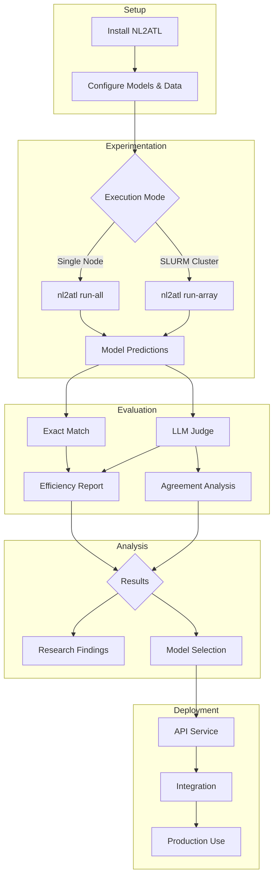

# NL2ATL Documentation

Welcome to the NL2ATL documentation. This guide provides comprehensive information on installing, configuring, using, and extending the NL2ATL framework for translating natural language to Alternating-Time Temporal Logic (ATL) formulas.

## About NL2ATL

NL2ATL is a research framework that leverages Large Language Models to automatically translate natural language specifications into formal ATL formulas. The framework provides:

- **End-to-end experimentation**: From data preparation through model training/inference to comprehensive evaluation
- **Multi-model support**: Compatible with Hugging Face transformers and Azure OpenAI
- **Advanced evaluation**: Exact-match, LLM-as-judge, inter-rater agreement, and efficiency analysis
- **Production deployment**: FastAPI service for integration with model checkers and verification tools
- **Reproducibility**: SLURM integration, configuration management, and automated experiment tracking

## Documentation Structure

### 🚀 Getting Started

Perfect for first-time users. Follow these in order:

| Document | Description | Read Time |
|----------|-------------|-----------|
| [Installation](installation.md) | Set up Python environment, install dependencies, configure API keys | 5 min |
| [Quick Start](quickstart.md) | Run your first experiment end-to-end in 5 minutes | 5 min |
| [ATL Primer](atl_primer.md) | Introduction to ATL syntax, semantics, and natural language patterns | 10 min |

**Recommended path**: Install → Quick Start → ATL Primer

### 📚 Core Guides

Essential references for working with NL2ATL:

| Document | Description | When to Use |
|----------|-------------|-------------|
| [Usage Guide](usage.md) | Complete CLI command reference with examples | When running experiments or analyzing results |
| [Configuration](configuration.md) | YAML config file reference and environment variables | When setting up models or customizing experiments |
| [Dataset](dataset.md) | Dataset schema, format, and usage | When working with training data or creating new datasets |
| [Evaluation](evaluation.md) | Evaluation metrics, pipelines, and interpretation | When analyzing model performance |

### 🎓 Advanced Topics

Deep dives into specific subsystems:

| Document | Description | When to Use |
|----------|-------------|-------------|
| [Difficulty Classification](difficulty_classification.md) | Rule-based difficulty scoring methodology | When analyzing dataset complexity or filtering examples |
| [SLURM Guide](slurm.md) | Parallel experiment execution with SLURM arrays | When running large-scale multi-model sweeps |
| [genVITAMIN Integration](genvitamin.md) | Connect NL2ATL to genVITAMIN model checker | When deploying for end-user applications |

### 🔧 Technical Reference

For developers and contributors:

| Document | Description | When to Use |
|----------|-------------|-------------|
| [Architecture](architecture.md) | System design, module organization, data flow | When extending the framework or understanding internals |
| [API Reference](api.md) | Public modules, classes, and functions | When integrating NL2ATL programmatically |
| [Development](development.md) | Contributing guidelines and development setup | When contributing code or custom extensions |

## Quick Navigation by Task

### "I want to..."

#### ...run my first experiment
1. [Install](installation.md) → Set up environment
2. [Quick Start](quickstart.md) → Run experiment
3. [Usage Guide](usage.md) → Explore more commands

#### ...understand ATL syntax
- [ATL Primer](atl_primer.md) → Complete ATL introduction
- [Dataset](dataset.md) → See real examples

#### ...configure a new model
- [Configuration](configuration.md) → Model registry format
- [Architecture](architecture.md) → Model loading system

#### ...run large-scale experiments
- [SLURM Guide](slurm.md) → Parallel execution
- [Usage Guide](usage.md) → CLI reference
- [Configuration](configuration.md) → Experiment conditions

#### ...evaluate model quality
- [Evaluation](evaluation.md) → All evaluation methods
- [Usage Guide](usage.md) → CLI commands for evaluation

#### ...integrate with my tool
- [genVITAMIN Integration](genvitamin.md) → Model checker example
- [API Reference](api.md) → Programmatic usage
- Source: `src/api_server.py` → FastAPI endpoint

#### ...extend the framework
- [Development](development.md) → Contributing guide
- [Architecture](architecture.md) → System design
- [API Reference](api.md) → Internal APIs

## Workflow Overview

The typical NL2ATL workflow:



## System Architecture

High-level component view:

```
┌─────────────────────────────────────────────────────────────┐
│                         NL2ATL CLI                          │
│                      (nl2atl command)                       │
└─────────────────────────────────────────────────────────────┘
                              │
          ┌───────────────────┼───────────────────┐
          ▼                   ▼                   ▼
┌──────────────────┐  ┌──────────────┐  ┌─────────────────┐
│   Experiment     │  │  Evaluation  │  │   API Service   │
│   Orchestration  │  │   Pipeline   │  │   (FastAPI)     │
└──────────────────┘  └──────────────┘  └─────────────────┘
          │                   │                   │
    ┌─────┴─────┐        ┌───┴────┐         ┌────┴────┐
    ▼           ▼        ▼        ▼         ▼         ▼
┌───────┐  ┌─────────┐ ┌────┐ ┌──────┐  ┌──────┐ ┌────────┐
│ Model │  │  Data   │ │Eval│ │Judge │  │Model │ │Prompt  │
│ Reg.  │  │ Manager │ │    │ │      │  │Load  │ │Format  │
└───────┘  └─────────┘ └────┘ └──────┘  └──────┘ └────────┘
```

See [Architecture](architecture.md) for detailed module descriptions.

## Key Concepts

### ATL Formulas

ATL (Alternating-Time Temporal Logic) expresses what coalitions of agents can strategically guarantee:

- **Coalition**: `<<A,B>>` — Agents A and B working together
- **Temporal operators**: `G` (always), `F` (eventually), `X` (next), `U` (until)
- **Logic**: `!` (not), `&&` (and), `||` (or), `->` (implies)

Example: `<<User>>G (request -> F grant)`  
_"The user can ensure that every request is eventually granted"_

### Experiment Conditions

Experiments test different configurations:

- **baseline_zero_shot**: Pretrained model without examples
- **baseline_few_shot**: Pretrained model with in-context examples
- **finetuned_zero_shot**: Fine-tuned model without examples
- **finetuned_few_shot**: Fine-tuned model with examples

### Evaluation Methods

1. **Exact Match**: Normalized string comparison (fast baseline)
2. **LLM Judge**: Semantic correctness via GPT/Claude (robust)
3. **Agreement**: Inter-rater reliability (Cohen's κ, Fleiss' κ)
4. **Efficiency**: Cost-latency-accuracy trade-offs

### Difficulty Classification

Samples are labeled `easy` or `hard` based on:
- **Formula complexity**: Nesting, operators, coalition size
- **NL ambiguity**: Implicit operators, scope ambiguity, semantic gaps

## Repository Structure

```
nl2atl/
├── src/
│   ├── cli/              # Command-line interface
│   ├── experiment/       # Experiment orchestration
│   ├── models/           # Model loading and inference
│   ├── evaluation/       # Evaluation pipelines
│   ├── infra/           # I/O and utilities
│   └── api_server.py    # FastAPI service
├── configs/
│   ├── models.yaml       # Model registry
│   └── experiments.yaml  # Experiment conditions
├── data/
│   └── dataset.json     # Training/test data
├── docs/                # Documentation (you are here)
├── tests/               # Unit tests
├── outputs/             # Generated results
│   ├── model_predictions/
│   └── LLM-evaluation/
└── integrations/
    └── genvitamin/      # Model checker integration
```

## Common Tasks

### Run a single experiment
```bash
nl2atl run-single --model qwen-3b --few_shot
```

### Evaluate predictions
```bash
nl2atl llm-judge --datasets all
nl2atl model-efficiency --predictions_dir outputs/model_predictions
```

### Classify dataset difficulty
```bash
nl2atl classify-difficulty --input data/dataset.json --verbose
```

### Start API service
```bash
uvicorn src.api_server:app --host 0.0.0.0 --port 8081
```

### Submit SLURM array
```bash
nl2atl slurm array --partition A100 --time 06:00:00
```

See [Usage Guide](usage.md) for comprehensive command reference.

## Environment Variables

Key environment variables (see [Configuration](configuration.md) for complete list):

```bash
# Azure OpenAI (if using Azure models)
AZURE_API_KEY=your_key_here
AZURE_INFER_ENDPOINT=https://your-endpoint.openai.azure.com/
AZURE_INFER_MODEL=gpt-5.2

# Hugging Face (for gated models)
HUGGINGFACE_TOKEN=your_token_here

# Weights & Biases (optional)
WANDB_API_KEY=your_key_here

# API Service (required for API deployment)
NL2ATL_DEFAULT_MODEL=qwen-3b
NL2ATL_MODELS_CONFIG=configs/models.yaml
NL2ATL_EXPERIMENTS_CONFIG=configs/experiments.yaml
```

## Output Files

All results are saved to `outputs/`:

```
outputs/
├── model_predictions/
│   └── qwen-3b_baseline_zero_shot.json
└── LLM-evaluation/
    ├── evaluated_datasets/
    │   └── gpt-5.2/
    │       └── qwen-3b_baseline_zero_shot__judge-gpt-5.2.json
    ├── summary__judge-gpt-5.2.json
    ├── efficiency_report.json
    ├── efficiency_report.ipynb
    └── agreement_report.json
```

## Citation

If you use NL2ATL in your research:

```bibtex
@inproceedings{aruta2026nl2atl,
  title={Translating Natural Language to Strategic Temporal Specifications via LLMs},
  author={Aruta, Marco and Improta, Francesco and Malvone, Vadim and 
          Murano, Aniello and Perli{\'c}, Vladana},
  booktitle={[Conference/Journal]},
  year={2026}
}
```

## Support

- **Documentation**: Start with [Quick Start](quickstart.md)
- **Issues**: [GitHub Issues](https://github.com/vladanaSTM/nl2atl/issues)
- **Development**: See [Development Guide](development.md)

## License

NL2ATL is released under the MIT License.

---

**Ready to begin?** Start with the [Installation Guide](installation.md) →
