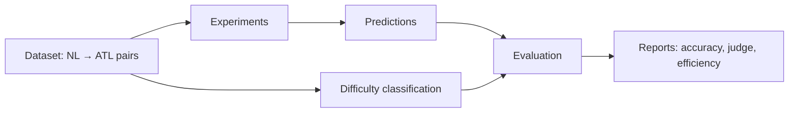

# NL2ATL Documentation

NL2ATL is a research framework for translating natural‑language specifications into ATL formulas using
Large Language Models. It supports experiment orchestration, evaluation, difficulty classification, and
efficiency analysis for paper‑ready comparisons.

## How to use this documentation (recommended order)

1) **Install and run a first experiment**
  - Start here: [installation.md](installation.md)
  - Then: [quickstart.md](quickstart.md)
2) **Understand ATL and the dataset**
  - ATL primer: [atl-primer.md](atl-primer.md)
  - Dataset format: [dataset.md](dataset.md)
3) **Configure and run experiments**
  - Config files: [configuration.md](configuration.md)
  - CLI workflows: [usage.md](usage.md)
4) **Evaluate and analyze**
  - Metrics and evaluation: [evaluation.md](evaluation.md)
  - Difficulty labeling: [difficulty_classification.md](difficulty_classification.md)
5) **Integrate into UI tools**
  - genVITAMIN wiring: [integrations/genvitamin.md](integrations/genvitamin.md)
6) **Deep dive and extend**
  - Architecture: [architecture.md](architecture.md)
  - API reference: [api.md](api.md)
  - Development guide: [development.md](development.md)

## Workflow at a glance



## Documentation map

### Getting Started

| Document | Purpose |
|----------|---------|
| [Installation](installation.md) | Setup instructions and dependencies |
| [Quick Start](quickstart.md) | First experiment end‑to‑end |
| [ATL Primer](atl-primer.md) | ATL/ATL* overview and notation |

### User Guide

| Document | Purpose |
|----------|---------|
| [Usage Guide](usage.md) | CLI commands and workflows |
| [Configuration](configuration.md) | Model/experiment config formats |
| [Dataset](dataset.md) | Dataset schema and conventions |
| [Difficulty Classification](difficulty_classification.md) | Difficulty scoring and labeling |
| [genVITAMIN Integration](integrations/genvitamin.md) | Wire NL2ATL into genVITAMIN |

### Technical Reference

| Document | Purpose |
|----------|---------|
| [Architecture](architecture.md) | Modules, data flow, design | 
| [Evaluation](evaluation.md) | Metrics and evaluation pipelines |
| [API Reference](api.md) | Public modules and classes |

### Contributing

| Document | Purpose |
|----------|---------|
| [Development](development.md) | Contribution and extension guide |

## Repository structure

```
nl2atl/
├── nl2atl.py              # CLI entrypoint
├── configs/               # Experiment and model configurations
├── data/                  # Dataset (NL-ATL pairs)
├── outputs/               # Predictions and evaluations
├── docs/                  # Documentation
├── tests/                 # Unit tests
└── src/                   # Source code
  ├── cli/               # Command-line interface
  ├── experiment/        # Experiment orchestration
  ├── models/            # Model loading and inference
  ├── evaluation/        # Evaluation pipelines
  └── infra/             # Infrastructure utilities
```

## Citation

If you use NL2ATL in your research, cite:

```bibtex
@inproceedings{aruta2026nl2atl,
  title={Translating Natural Language to Strategic Temporal Specifications via LLMs},
  author={Aruta, Marco and Improta, Francesco and Malvone, Vadim and Murano, Aniello and Perli{\'c}, Vladana},
  booktitle={[Conference/Journal]},
  year={2026}
}
```

## License and acknowledgments

NL2ATL is MIT‑licensed. See [LICENSE](../LICENSE).

Acknowledgments: University of Naples Federico II; Telecom Paris.