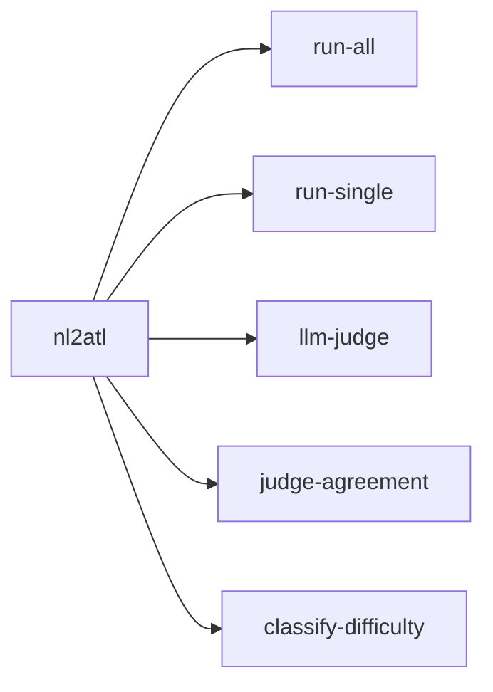
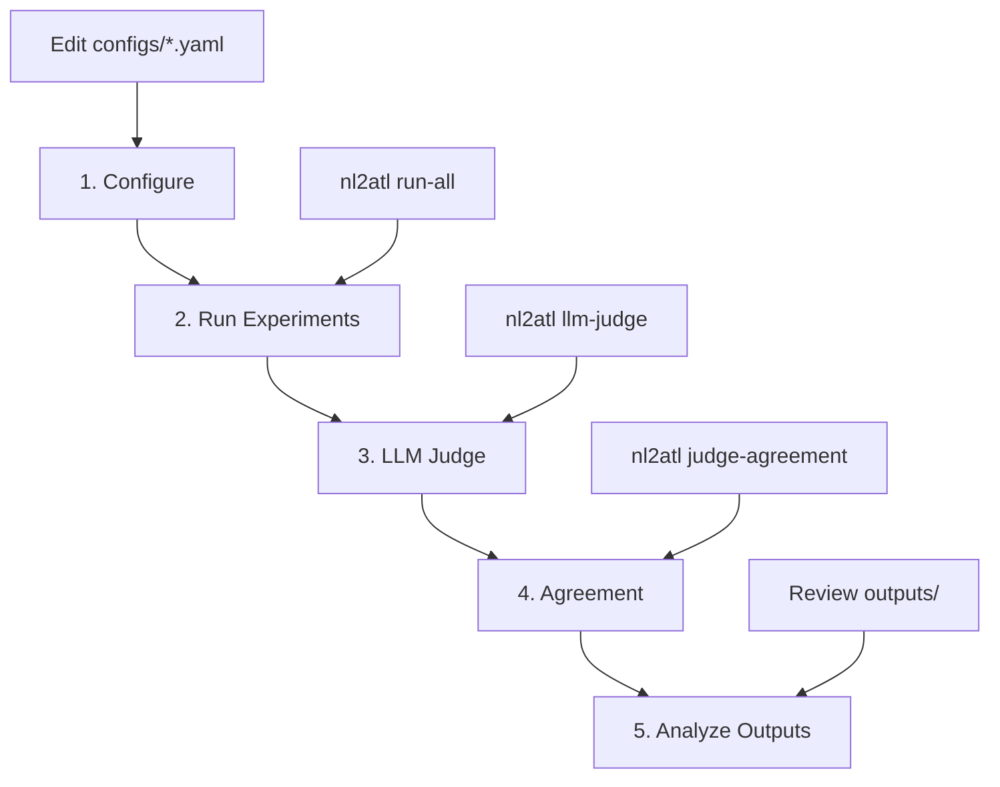

# Usage Guide

This guide covers the main workflows for using NL2ATL.

## Table of Contents

- [CLI Overview](#cli-overview)
- [Running Experiments](#running-experiments)
- [Evaluation](#evaluation)
- [Typical Workflow](#typical-workflow)
- [Output Files](#output-files)

---

## CLI Overview



| Command | Description |
|---------|-------------|
| `run-all` | Execute all experiments in configuration |
| `run-single` | Run a specific model/condition setup |
| `llm-judge` | Run LLM judge evaluation on prediction files |
| `judge-agreement` | Compute inter-rater agreement metrics |
| `classify-difficulty` | Classify dataset samples by difficulty |

---

## Running Experiments

### Run All Experiments

```bash
nl2atl run-all
```

Key options:

- `--models`: limit to specific model keys
- `--conditions`: limit to condition names
- `--model_provider`: `hf`, `azure`, or `all`
- `--overwrite` / `--force`: re-run even if output exists
- `--models_config`, `--experiments_config`: config file paths

Example:

```bash
nl2atl run-all --models qwen-3b --conditions baseline_zero_shot
```

### Run Single Experiment

```bash
nl2atl run-single --model qwen-3b --few_shot
```

Key options:

- `--model`: model key from `configs/models.yaml`
- `--finetuned`: use fine-tuned adapter (if allowed)
- `--few_shot`: enable few-shot prompting
- `--models_config`, `--experiments_config`: config file paths

---

## Evaluation

### LLM Judge Evaluation

```bash
nl2atl llm-judge --datasets all
```

Existing evaluated datasets are skipped unless `--overwrite/--force` is provided.

Key options:

- `--datasets`: list of prediction files or `all`
- `--models_config`: models config path (for judge selection)
- `--predictions_dir`: default `outputs/model_predictions`
- `--output_dir`: default `outputs/LLM-evaluation`
- `--no_llm`: disable LLM calls and only use exact-match
- `--overwrite` / `--force`: re-evaluate even if evaluated outputs already exist
- `--model` / `--models` / `--judge_model` / `--judge_models`: judge model names

### Judge Agreement

```bash
nl2atl judge-agreement --eval_dir outputs/LLM-evaluation/evaluated_datasets
```

Key options:

- `--judges`: select specific judge directories
- `--output`: output path (defaults to `eval_dir/../agreement_report.json`)
- `--human_annotations`: optional human annotations JSON (adds a `human` judge)
- `--no_disagreements`: exclude sample disagreements from report
- `--max_disagreements`: cap number of disagreement examples

### Difficulty Classification

```bash
nl2atl classify-difficulty --input data/dataset.json --verbose
```

Key options:

- `--output`: path to write the updated dataset
- `--formula-weight`, `--nl-weight`, `--threshold`: scoring parameters

---

## Typical Workflow



---

## Output Files

After running experiments and evaluation:

```
outputs/
├── model_predictions/
│   └── <run_name>.json
└── LLM-evaluation/
    ├── evaluated_datasets/
    │   └── <judge>/
    │       └── <prediction>__judge-<judge>.json
    ├── summary__judge-<judge>.json
    └── agreement_report.json
```

### Prediction File Format

```json
{
  "metadata": {
    "run_id": "qwen-3b_baseline_zero_shot",
    "git_commit": "abc123",
    "dataset_path": "./data/dataset.json",
    "total_samples": 90,
    "successful_predictions": 90,
    "failed_predictions": 0,
    "model": "Qwen/Qwen2.5-3B-Instruct",
    "model_short": "qwen-3b",
    "condition": "baseline_zero_shot",
    "seed": 42,
    "finetuned": false,
    "few_shot": false,
    "num_epochs": 0,
    "learning_rate": 0.0002,
    "batch_size": 10,
    "num_few_shot": 0,
    "latency_mean_ms": 520.1,
    "timestamp_start": "2026-01-23T11:10:01Z",
    "timestamp_end": "2026-01-23T11:22:40Z",
    "duration_seconds": 759.4
  },
  "predictions": [
    {
      "id": "ex01",
      "input": "The user can guarantee that sooner or later the ticket will be printed.",
      "expected": "<<User>>F ticket_printed",
      "generated": "<<User>>F ticket_printed",
      "difficulty": "easy",
      "exact_match": 1,
      "latency_ms": 412.5,
      "tokens_input": 98,
      "tokens_output": 12
    }
  ]
}
```

### LLM Judge File Format

```json
{
  "run_name": "qwen-3b_baseline_zero_shot",
  "model": "qwen-3b",
  "condition": "baseline_zero_shot",
  "finetuned": false,
  "few_shot": false,
  "seed": 42,
  "metrics": {
    "n_examples": 90,
    "exact_match": 0.82
  },
  "judge_model": "gpt-5.2",
  "source_file": "qwen-3b_baseline_zero_shot.json",
  "detailed_results": [
    {
      "input": "The user can guarantee that sooner or later the ticket will be printed.",
      "gold": "<<User>>F ticket_printed",
      "prediction": "<<User>>F ticket_printed",
      "correct": "yes",
      "reasoning": "Exact match (normalized).",
      "decision_method": "exact"
    }
  ]
}
```
