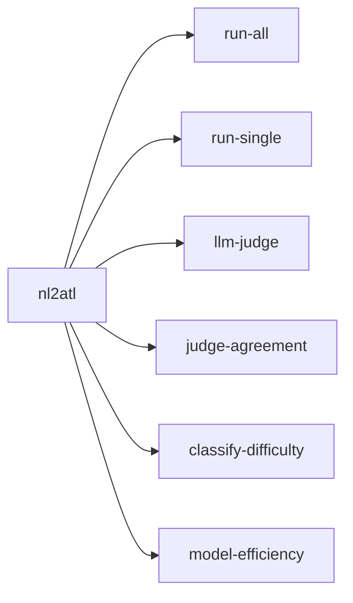
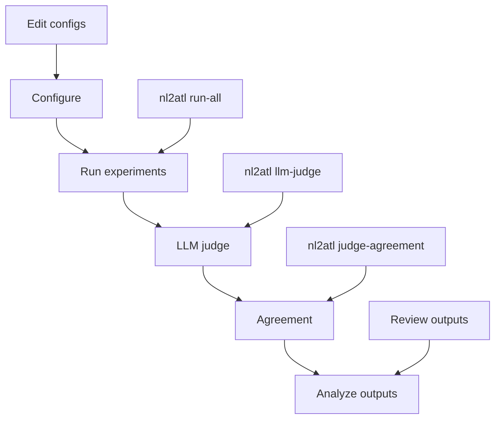

# Usage guide

This guide explains the core NL2ATL workflows: running experiments, evaluating outputs, and using the API service.

## CLI overview



| Command | Purpose |
|---|---|
| `run-all` | Run experiments from configuration files |
| `run-single` | Run a single model and condition |
| `run-array` | Run one SLURM array task (seed, model, condition) |
| `llm-judge` | Evaluate predictions with the LLM judge |
| `judge-agreement` | Compute inter‑rater agreement |
| `classify-difficulty` | Label dataset samples as easy or hard |
| `model-efficiency` | Summarize cost‑latency‑accuracy trade‑offs |

## Running experiments

### Recommended: SLURM arrays for sweeps

If you are running multiple models, conditions, or seeds, use SLURM arrays. Benefits:

- **Parallel execution** across GPUs and nodes
- **Scheduler‑managed resources** (no manual GPU juggling)
- **Fault isolation** (a single task failure does not kill the sweep)
- **Reproducibility** via explicit $(seed, model, condition)$ mapping

Inspect the task map:

```bash
nl2atl run-array --count
nl2atl run-array --list-tasks
```

Use filters when needed:

```bash
nl2atl run-array --models qwen-3b --conditions baseline_zero_shot --count
```

Submit with the provided SLURM helper script:

1) Edit resources and filters in [scripts/slurm/submit_array.sh](../scripts/slurm/submit_array.sh)
2) From the login node, submit:

```bash
sbatch scripts/slurm/submit_array.sh
```

The helper computes the array size and runs exactly one task per array index.

### Local runs (single node)

Use these for quick checks or when SLURM is unavailable.

#### Run a full sweep

```bash
nl2atl run-all
```

Common filters:

- `--models`: model keys from `configs/models.yaml`
- `--conditions`: condition names from `configs/experiments.yaml`
- `--model_provider`: `hf`, `azure`, or `all`
- `--overwrite` or `--force`: re‑run existing outputs

Example:

```bash
nl2atl run-all --models qwen-3b --conditions baseline_zero_shot
```

#### Run a single experiment

```bash
nl2atl run-single --model qwen-3b --few_shot
```

Common options:

- `--model`: model key from `configs/models.yaml`
- `--finetuned`: use a fine‑tuned adapter if available
- `--few_shot`: enable few‑shot prompting

#### Python entrypoints (optional)

If you prefer Python scripts, you can invoke the CLI modules directly:

```bash
python -m src.cli.run_all_experiments --models qwen-3b --conditions baseline_zero_shot
python -m src.cli.run_single_experiment --model qwen-3b --few_shot
python -m src.cli.run_experiment_array --list-tasks
```

## Evaluation

### LLM judge evaluation

```bash
nl2atl llm-judge --datasets all
```

Use `--overwrite` or `--force` to re‑evaluate existing outputs.

Key options:

- `--datasets`: list of prediction files or `all`
- `--predictions_dir`: default `outputs/model_predictions`
- `--output_dir`: default `outputs/LLM-evaluation`
- `--no_llm`: exact‑match only, skip LLM calls
- `--judge_model` or `--judge_models`: select judge models

### Judge agreement

```bash
nl2atl judge-agreement --eval_dir outputs/LLM-evaluation/evaluated_datasets
```

Key options:

- `--judges`: choose specific judge folders
- `--human_annotations`: add a `human` judge source
- `--no_disagreements` or `--max_disagreements`

### Difficulty classification

```bash
nl2atl classify-difficulty --input data/dataset.json --verbose
```

Key options:

- `--output`: output dataset path
- `--formula-weight`, `--nl-weight`, `--threshold`

Details: [difficulty_classification.md](difficulty_classification.md)

### Model efficiency

```bash
nl2atl model-efficiency --predictions_dir outputs/model_predictions
```

Key options:

- `--judge_summary`: path to `summary__judge-<judge>.json`
- `--judge_model`: choose a judge summary by model name
- `--weight_accuracy`, `--weight_cost`, `--weight_latency`
- `--top_k`: size of ranking lists
- `--no_notebook`: skip notebook output

## Typical workflow



## Output files

```
outputs/
├── model_predictions/
│   └── <run_name>.json
└── LLM-evaluation/
    ├── evaluated_datasets/
    │   └── <judge>/
    │       └── <prediction>__judge-<judge>.json
    ├── summary__judge-<judge>.json
    ├── efficiency_report.json
    ├── efficiency_report.ipynb
    └── agreement_report.json
```

### Prediction file format

```json
{
  "metadata": {
    "run_id": "qwen-3b_baseline_zero_shot",
    "model": "Qwen/Qwen2.5-3B-Instruct",
    "model_short": "qwen-3b",
    "condition": "baseline_zero_shot",
    "seed": 42,
    "finetuned": false,
    "few_shot": false,
    "num_few_shot": 0,
    "dataset_path": "./data/dataset.json",
    "total_samples": 90,
    "successful_predictions": 90,
    "failed_predictions": 0,
    "latency_mean_ms": 520.1,
    "latency_p95_ms": 910.5,
    "timestamp_start": "2026-01-27T10:12:40Z",
    "timestamp_end": "2026-01-27T10:20:05Z",
    "duration_seconds": 445.2
  },
  "predictions": [
    {
      "id": "ex01",
      "input": "The user can guarantee that sooner or later the ticket will be printed.",
      "expected": "<<User>>F ticket_printed",
      "generated": "<<User>>F ticket_printed",
      "difficulty": "easy",
      "exact_match": 1,
      "latency_ms": 412.7,
      "tokens_input": 143,
      "tokens_output": 21,
      "tokens_estimated": false
    }
  ]
}
```

Cost fields (`cost_usd`, `cost_input_usd`, `cost_output_usd`) appear when per‑token prices are set in
`configs/models.yaml`.

### LLM judge file format

```json
{
  "run_id": "qwen-3b_baseline_zero_shot",
  "model": "Qwen/Qwen2.5-3B-Instruct",
  "model_short": "qwen-3b",
  "condition": "baseline_zero_shot",
  "seed": 42,
  "judge_model": "gpt-5.2",
  "source_file": "qwen-3b_baseline_zero_shot.json",
  "detailed_results": [
    {
      "input": "...",
      "gold": "<<User>>F p",
      "prediction": "<<User>>F p",
      "correct": "yes",
      "reasoning": "Exact match (normalized).",
      "decision_method": "exact"
    }
  ]
}
```

## API service for UI integration

### Start the server

```bash
uvicorn src.api_server:app --host 0.0.0.0 --port 8081
```

If running from another directory, set absolute config paths:

```bash
NL2ATL_MODELS_CONFIG=/abs/path/to/nl2atl/configs/models.yaml
NL2ATL_EXPERIMENTS_CONFIG=/abs/path/to/nl2atl/configs/experiments.yaml
```

### Health check

```bash
curl http://localhost:8081/health
```

### Generate endpoint

```bash
curl -X POST http://localhost:8081/generate \
  -H "Content-Type: application/json" \
  -d '{
    "description": "Agent A can eventually reach goal",
    "model": "qwen-3b",
    "few_shot": true,
    "max_new_tokens": 128
  }'
```

### Common request fields

- `model`: model key from `configs/models.yaml`
- `few_shot`: enable few‑shot prompting
- `num_few_shot`: override number of few‑shot examples
- `adapter`: LoRA adapter name or path, Hugging Face only
- `max_new_tokens`: maximum generated tokens
- `return_raw`: include raw model output

### Response fields

- `formula`: generated ATL formula
- `model_key`: resolved model key
- `model_name`: underlying model
- `provider`: `hf` or `azure`
- `latency_ms`: end‑to‑end latency

Adapter paths are resolved against the `models_dir` from `configs/experiments.yaml` if relative.

For genVITAMIN integration, see [integrations/genvitamin.md](integrations/genvitamin.md).
